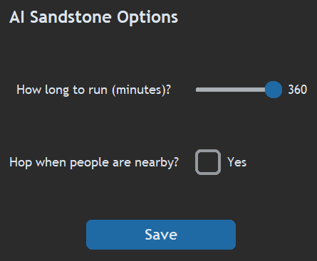
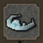
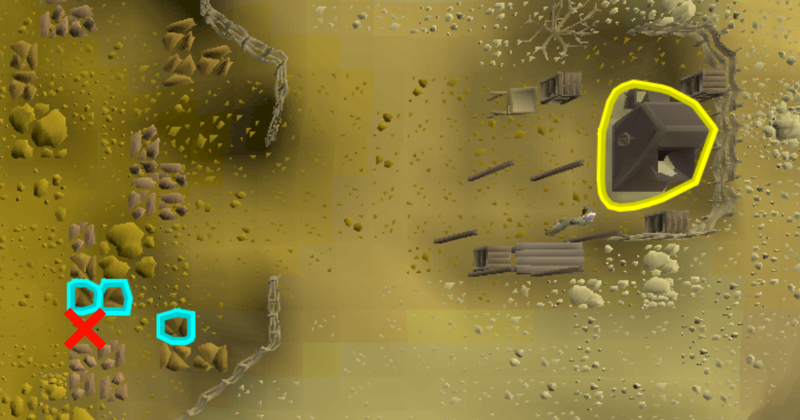
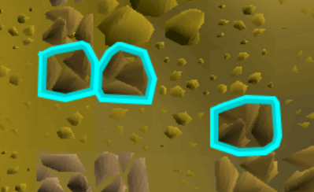
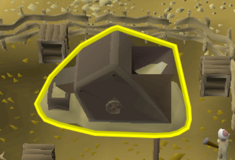

# AI am walking here's Bot Scripts

Welcome to the **AI_am_walking_here's** Bot Scripts Scripts repository! This is a place where I will create and share automation scripts for Old School RuneScape (OSRS). I'm excited to bring the power of automation to the game and enhance the gameplay experience.

## About

In this repository, you'll find a collection(*in due time*) of bot scripts designed to automate various tasks in OSRS. These scripts are developed with the aim of saving time and convenience. OSRS is a grind heavy game, but it doesn't have to be. It's also important to remeber real life comes first, so let the scripts worry about the pixels. **Enjoy your new found free time!!!**

## Bots
1. AI_sandstone
2. *To be continued...*

### AI_Sandstone
Enhance your sandstone mining activities in Old School RuneScape with the Sandstone Bot. This automation script operates for up to 6 hours, systematically mining and depositing sandstone until reaching a limit of 25,000 units. At 25,000 units of sandstone the Sandstone Bot will auto-log. Additionally settings can include "Hop When People Are Nearby" to avoid fighting for the same rocks as others to avoid conflict and detection.

#### Features
- Human Like Movement
    - Random Click Distribution
    - Color Object Detection
    - Human Like Mouse Movement
- Auto Log
    - Nearby Players
    - Finished script    
- Buckets of Sand Gathered Logs
- Xp Gained Logs
- Image Searching
- Optical Character Recognition

#### Option Menu
- Running time: 1 Minute - 6 Hours(nerd log)
- Hop for nearby players - [Yes] or [no] 

#### Recommended Items
- Circlet of Water ... Remember to charge it to protect from Desert Heat

#### Getting Started
1. First insert the "AI_Sandstone" bot folder into your OSBC Project. 
`OS-Bot_COLOR/src/model/osrs/<insert folder here>`

2. In your `OS-Bot_COLOR/src/model/osrs/__init__.py` 
Copy/Paste this line into your init file ---> 
`from .AI_Sandstone.ai_sandstone import SandstoneMiner`

3. Once your files are configured correctly it is time to run the bot. Run `OSBC.py`
4. Go over to select a game and select `OSRS`
5. Select `Skip` to move to script screen
6. select `AI Sandstone`
7. Select `Options` choose your desired options
8. select `Launch Game`  
   if this is your first bot follow the sub instructions.
   - First: Locate and select the Runelite.exe 
   - Second: Locate and select the Runelite Profiles "Try:`C:/Users/<user>/.runelite/profiles2`"  
9. Make sure when standing on the RED-X you are able to see the sandstone grinder fully.

10. Make sure the rocks are Tagged in CYAN and the Grinder is tagged in YELLOW. If you did everything right, it should already be tagged when launched.

11. Enjoy your botting!!!
