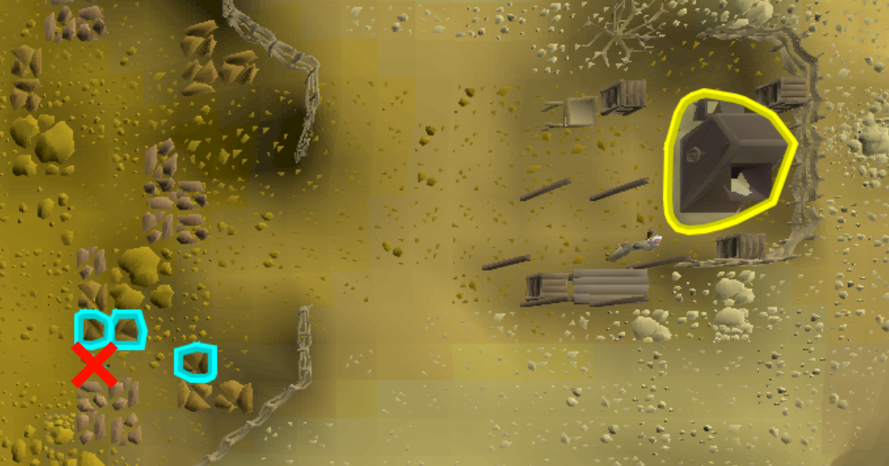

# AI am walking here's Bot Scripts

Welcome to the **AI_am_walking_here's** Bot Scripts Scripts repository! This is a place where I will create and share automation scripts for Old School RuneScape (OSRS). I'm excited to bring the power of automation to the game and enhance the gameplay experience.

## About

In this repository, you'll find a collection(*in due time*) of bot scripts designed to automate various tasks in OSRS. These scripts are developed with the aim of saving time and convenience. OSRS is a grind heavy game, but it doesn't have to be. It's also important to remeber real life comes first, so let the scripts worry about the pixels. **Enjoy your new found free time!!!**

## Bots
1. AI_sandstone
2. *To be continued...*

### AI_Sandstone
Enhance your sandstone mining activities in Old School RuneScape with the Sandstone Bot. This automation script operates for up to 6 hours, systematically mining and depositing sandstone until reaching a limit of 25,000 units.

#### Features
- Human Like Movement
    - Random Click Distribution
    - Color Object Detection
    - Human Like Mouse Movement
- Auto Log
    - Nearby Players
    - Finished script    
- Buckets of Sand Gathered Logs
- Xp Gained Logs
- Image Searching
- Optical Character Recognition

#### Option Menu
- Running time: 1 Minute - 6 Hours(nerd log)
- Hop for nearby players - [Yes] or [no] 

#### Rates

#### Getting Started
1. Make sure your models are taged like this.

